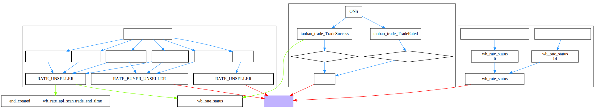
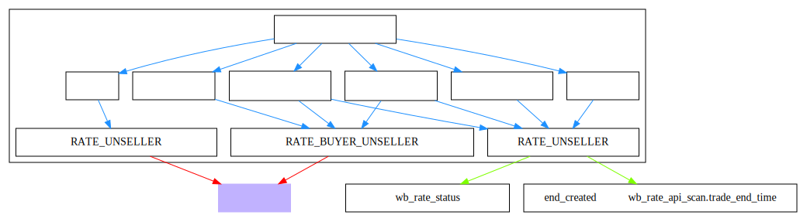
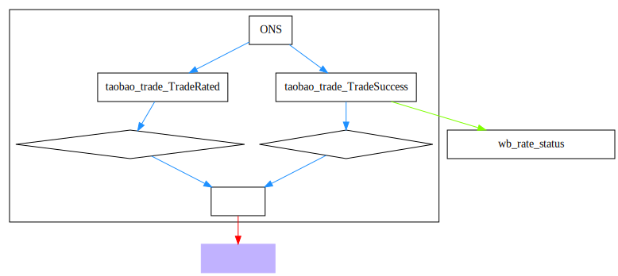
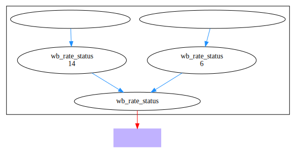

# 新版自动评价文档

	创建于20190504

## 18 新版自动评价



### API


### ONS


### RDS


## 流程图构建工具

### 简介
```
Graphviz是开源图形可视化软件。图形可视化是一种将结构信息表示为抽象图和网络图的方法。它在网络，生物信息学，软件工程，
数据库和网页设计，机器学习以及其他技术领域的可视化界面中具有重要的应用。
```

### 官方下载并安装

下载路径：<a href="http://www.graphviz.org/download/" target="_blank">点击进入查看</a>

官方文档路径：<a href="https://graphviz.gitlab.io/_pages/pdf/dotguide.pdf" target="_blank">点击进入查看</a>


